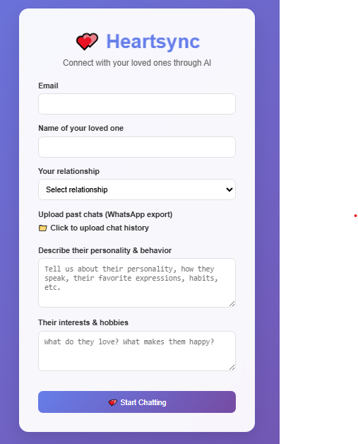
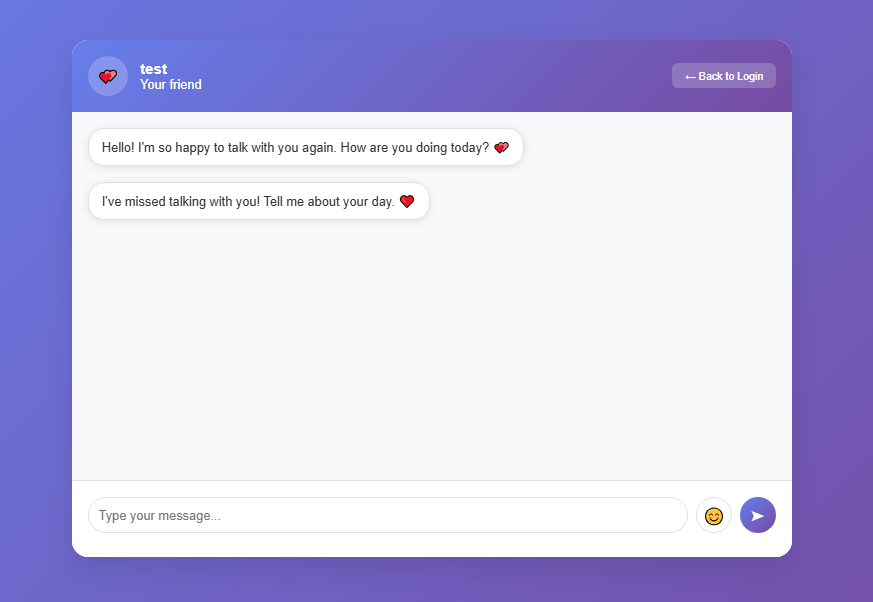

# 💖 HeartSync — Talk to Memories, Powered by AI

HeartSync is a web application that allows users to chat with an AI trained on their own WhatsApp conversations with a loved one. Whether you're coping with loss, preserving a connection, or seeking emotional comfort, HeartSync revives that bond through memory-persistent and emotionally intelligent conversations.

---

## 🌟 Features

- 📁 Upload WhatsApp Chat File
- 🧠 AI responds like your loved one using Gemini 1.5
- 🔐 Local and secure data handling
- 💬 Memory-Persistent Chat (stores every message you send)
- 🧾 Personalized responses based on:
  - Relationship
  - Personality traits
  - Shared interests
- 📜 Built using modern web technologies


## 🖼️ Screenshots

| Login Page                         | AI Chat Page                        |
|------------------------------------|-------------------------------------|
|  |      |

---

## ⚙️ Tech Stack

- **Frontend:** HTML5, Tailwind CSS, JavaScript (Vanilla)
- **Backend:** Node.js, Express.js
- **AI Model:** Google Gemini 1.5 (via API)
- **File Handling:** Multer, File System (fs)
- **Storage:** Local file-based (stored in `Backend/data/`)
- **Security:** Email-based separation, no external DB needed

---

## 🚀 Getting Started

### 1. Clone the Repository

```bash
git clone https://github.com/ishant37/HeartSync.git
cd heartsync

```bash
cd Backend
npm install


Create a .env file in the Backend folder and add your Google Gemini API Key:
PORT=5000
MONGODB_URI=mongodb://localhost:27017/filename
GEMINI_API_KEY=your_gemini_api_key


Then-
npm run dev


HeartSync/
├── Backend/
│   ├── data/                  # Saved chats and user JSON files
│   ├── controllers/
│   ├── routes/
│   ├── models/
│   └── server.js
├── login.html
├── chat.html
├── login.js
├── chat.js
└── README.md
